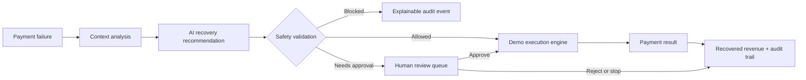

# RecoverAI – Intelligent Revenue Recovery Agent

RecoverAI is a production-quality demo workspace for the Razorpay AI Builder Internship 2026, Track 3: AI Revenue Recovery. It helps merchants turn failed payments into measurable, explainable next steps without giving an AI unrestricted control over money movement.

## Problem

Failed payments are often treated as a flat retry queue. That creates avoidable customer friction, misses recoverable revenue, and makes it difficult for a merchant to understand why an action was taken.

## Solution

RecoverAI combines payment context, customer history, recovery probability, deterministic merchant guardrails, and a controlled execution engine:

## Key features

- Merchant dashboard for revenue at risk, recovered revenue, recovery rate, failed payments, scan activity, outcomes, and recent activity.
- 50 deterministic demo payments across 20 customers with multiple failure reasons, recovery outcomes, and review cases.
- AI Recovery workspace with a runnable scan that analyzes eligible failures, recommends actions, applies safety rules, and executes eligible demo actions.
- Payment detail view with customer context, timeline, AI reasoning, confidence, safety checks, actions, and audit history.
- Human review queue with approve, reject, and stop decisions.
- Analytics for recovery funnel, action attribution, AI versus merchant-assisted recovery, and retry outcomes.
- Searchable audit trail for recommendations, safety evaluations, execution results, and merchant changes.
- Safety settings for retry limits, amount limits, probability thresholds, approval thresholds, automatic recovery, and demo mode.
- Razorpay Test Mode-ready architecture; this build intentionally defaults to a controlled simulated processor and never moves real money.

## Architecture

- Frontend: React, TypeScript, Vite, Tailwind CSS, Wouter, TanStack Query.
- Backend: Node.js, TypeScript, Express 5.
- Database: PostgreSQL with Drizzle ORM and relational tables for users, merchants, customers, payments, attempts, recovery cases, AI decisions, actions, audit logs, and settings.
- API contracts: OpenAPI-first in `lib/api-spec/openapi.yaml`, with generated React Query hooks and Zod schemas.
- AI layer: modular demo recovery agent abstraction with structured decisions. It is safe to swap in a Replit AI Integration-backed LLM later without moving execution authority into the model.

## Safety mechanisms

Every automated action follows:

1. AI recommendation
2. Deterministic safety validation
3. Action execution
4. Result recording
5. Audit event

The default rules are conservative: two automated retries, a ₹10,000 automated amount limit, a 70% minimum recovery probability, human approval for high-value payments, and automatic stopping after repeated failures. A blocked action returns the failed rule and records the reason.

## Demo instructions

1. Start the API and web workflows.
2. Open the app and select **Enter workspace**.
3. Review the dashboard and open **Recovery**.
4. Select **Run recovery scan** to analyze eligible payments and execute only safe deterministic actions.
5. Open **Human review** to approve or reject cases.
6. Open a payment to inspect the timeline, AI explanation, safety checks, and audit history.
7. Change a setting and save it; the update is persisted by the API and recorded in the audit trail.

Demo data is stable across a fresh server start, so evaluations are repeatable. The UI labels the environment as Demo and the payment engine reports simulated Razorpay Test Mode outcomes.

## API overview

| Method | Endpoint | Purpose |
| --- | --- | --- |
| GET | `/api/dashboard` | Dashboard metrics, trends, breakdowns, and activity |
| GET | `/api/payments`, `/api/payments/:id` | Payment list and detail |
| GET | `/api/customers`, `/api/customers/:id` | Customer list and profile |
| GET | `/api/recovery/cases` | Human review queue |
| POST | `/api/recovery/analyze` | Generate a structured AI decision |
| POST | `/api/recovery/scan` | Run the complete bounded recovery scan |
| POST | `/api/recovery/actions` | Create a recovery action |
| POST | `/api/recovery/actions/:id/approve` | Approve and safely execute a review action |
| POST | `/api/recovery/actions/:id/reject` | Reject a review action |
| POST | `/api/recovery/actions/:id/execute` | Execute an approved action |
| POST | `/api/recovery/:id/stop` | Stop payment recovery |
| GET | `/api/analytics` | Recovery impact and funnel metrics |
| GET | `/api/audit` | Searchable audit events |
| GET/PUT | `/api/settings` | Read and update merchant guardrails |

## Database design

The Drizzle schema in `lib/db/src/schema/index.ts` defines the required relational tables and foreign-key relationships. The demo engine uses deterministic server-side records so the app remains immediately usable in an evaluation environment; the database schema is ready for replacing the demo repository with PostgreSQL-backed repositories.

## Environment variables

- `DATABASE_URL` – PostgreSQL connection string used by Drizzle migrations and the shared database library.
- `SESSION_SECRET` – reserved for a future authenticated merchant session.
- `RAZORPAY_KEY_ID` / `RAZORPAY_KEY_SECRET` – optional future Razorpay Test Mode credentials; do not expose them to the frontend.
- `AI_INTEGRATION` – optional future selector for a Replit AI Integration provider. Demo mode works without it.

## Razorpay Test Mode setup

When adding live test-mode connectivity, keep credentials in workspace secrets, use Razorpay test keys only, and keep the existing safety layer in front of every retry or payment action. The simulated processor should remain available as the explicit fallback when credentials or the payment API are unavailable.

## Example recovery workflow

`Bank timeout → 87% probability → Retry Payment → amount and retry checks pass → simulated processor succeeds → payment becomes Recovered → recovered revenue and audit trail update`.

## Metrics

Dashboard and analytics values are calculated from the same server-side payment, case, action, and audit state. Recovery rate, funnel counts, action attribution, and recovered amounts therefore update when a scan or merchant decision changes state.

## Future improvements

- Replace the in-memory demo repository with PostgreSQL-backed repositories and migrations for production tenancy.
- Add Replit-managed Clerk authentication and merchant isolation.
- Add an optional Replit AI Integration provider with structured tool calling for richer reasoning.
- Add a Razorpay Test Mode adapter and webhook ingestion.
- Add scheduled jobs, notification preferences, rate limiting, and idempotency keys.
